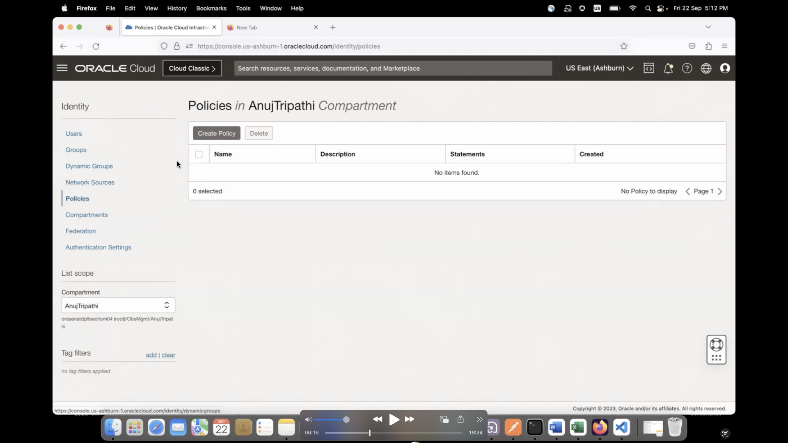

# Oracle Identity and Access Management (IAM) Authentication with Autonomous Database

## Introduction

Use Identity and Access Management (IAM) Authentication with Autonomous Database. An Oracle Cloud Infrastructure IAM database password allows an IAM user to log in to an Autonomous Database instance as Oracle Database users typically log in with a user name and password. The user enters their IAM user name and IAM database password. An IAM database password is a different password than the Oracle Cloud Infrastructure Console password. Using an IAM user with the password verifier you can login to Autonomous Database with any supported database client.

### Objectives

In this tutorial, you will:
You can configure Autonomous Database to use Oracle Cloud Infrastructure Identity and Access Management (IAM) authentication and authorization to allow IAM users to access an Autonomous Database with IAM credentials.

### Prerequisites

* **Provisioned Autonomous Database** in OCI 
* OCI IAM Identity Domains tenancy with Administrator privilege
* Access to a Windows system. This configuration has been tested for a Database client for a Windows system. 

## Task 1:  Create Database Groups,Users and Policies

1. Navigate to **Identity & Security -> Groups**. Click on **Create Group**. Provide the following details to create groups - DB_Admins and DB_Users

    * Name: DB_Admins
    * Description: DB_Admins

    Click **Create**

    * Name:DB_Users
    * Description: DB_Users

    Click **Create**
    
	

2. Navigate to **Identity-> Policy** Click on **Create Policy**. Enter the following details.

    - Name: ADB-Access-Policy
    - Description: ADB-Access-Policy
    - Compartment: Ensure the correct compartment is selected
    -Policy Builder: Select the Show manual editor option

        allow group DB_Users, DB_Admins to use database-connections in compartment <compartment-name>
		allow group DB_Users, DB_Admins to use autonomous-database-family in compartment <compartment-name>
    
    Click **Create** Policy has been created

    

    

    

3. Navigate to **Identity-> Users**. Click Create User and enter the following details to create two test users - **testuser1 and testuser2**

    * Select the User Type: IAM User
    * Username: testuser1
    * Description: testuser1
    * Email: testuser1@demo.com
    * Confirm Email: testuser1@demo.com

    Click Create

     

      

    * Add **testuser1** to **DB_Users group**

    Now repeat the setps for testuser2.

    - Select the User Type: IAM User
    - Username: testuser2
    - Description: testuser2
    - Email: testuser2@demo.com
    - Confirm Email: testuser2@demo.com

    Click Create

    - Add the **testuser2** to **DB_Admins and DB_Users groups**

   

    

## Task 3: Set the IAM Database Password for the Users - testuser1 and testuser2

1. Navigate to **Identity -> Users**

2. Select testuser1. The Database username is testuser1. Select Database Password. Click on **Create Database Password**

3. Enter the following details : 

    * description: password
    * password: Orcl123##test
    * confirm password: Orcl123##test
    
    Click **Create database password**

     

     

4. Select testuser2. The Database username is testuser2 . Now, Select Database Password. Click on **Create Database Password**

5. Enter the following details : 

    - description: password
    - password: Orcl123##test
    - confirm password: Orcl123##test
    
    Click **Create database password**

     

     

     

    Now you have succesfully created the database passwords for the testuser1 and testuser2.  

## Task 4: Configure database for create global user schema mappings and role mappings for DB_Users and  DB_Admins groups

1. In OCI, navigate to **Autonomous Database -> Database Actions -> SQL**. The SQL session is created. 

    

    

    

2. Verify the **current External Identity Provider** for Autonomous Database

    SELECT NAME, VALUE FROM V$PARAMETER WHERE NAME=‘identity_provider_type’;

     

    It is currently **None**

3.  Configuring **OCI IAM** as an **External Identity Provider** for Autonomous Database

    EXEC DBMS_CLOUD_ADMIN.ENABLE_EXTERNAL_AUTHENTICATION(‘OCI_IAM’);

     

    SELECT NAME, VALUE FROM V$PARAMETER WHERE NAME=‘identity_provider_type’;

     

    It is currently set to **OCI_IAM** 

4. Configure database for create global user schema mappings and role mappings for **DB_Users and  DB_Admins groups**

    CREATE USER global_user IDENTIFIED GLOBALLY AS 'IAM_GROUP_NAME=DB_Users';
    CREATE ROLE global_role IDENTIFIED GLOBALLY AS 'IAM_GROUP_NAME=DB_Admins';
    grant create session to global_user;
    grant DWROLE to global_role;
    grant CREATE SESSION to global_role;
    GRANT DWROLE TO global_role;

     

## Task 5: Download the SQL*Plus Database Client

1. Ensure you install the latest release updates for your Oracle Database client releases 19c - 19.20.0 based on the Operating System.

2. In this tutorial , we are using **Windows OS**

3. Please refer to the official link for download of the SQL*Plus DB client - https://www.oracle.com/database/technologies/instant-client.html

## Task 6: Download Wallet

1. Navigate to **Oracle Cloud -> Databases-> Autonomous Database** and select the autonomous database provisioned . Click on the **Database Connection**

2. Enter a password and download the wallet.

   

   

## Task 7: Update the Wallet location in sqlnet.ora and set the TNS Admin variable

1. Update the downloaded wallet location path in the sqlnet.ora file.

2. Set up the environment variable : TNS_Admin with the wallet location path.

## Task 8: Connect to DB using Powershell

1. Open Windows Powershell, enter the following queries:

    sqlplus /nolog

    * Demostrating the **Local Authentication** for **Administrator User**

    conn admin/QAZwsxedc321##@adwtest_high

    exit 

    Now you are successfully connected to the **Autonomous Database** as the **Administrator**

    * Demonstrating **Password-Based Authentication** for **testuser1,testuser2** and Validate Users and Roles in the Database
 

    conn testuser1/Orcl123##test@adwtest_high

    SELECT SYS_CONTEXT ('USERENV','CURRENT_USER') FROM DUAL;

    SELECT SYS_CONTEXT ('USERENV','AUTHENTICATED_IDENTITY') FROM DUAL;

    SELECT SYS_CONTEXT ('USERENV','ENTERPRISE_IDENTITY') FROM DUAL;

    SELECT * FROM SESSION_ROLES;

    exit

     

    Now you haved  successfully tested the connection to the **Autonomous Database** as the **testuser1**

    conn testuser2/Orcl123##test@adwtest_high

    SELECT SYS_CONTEXT ('USERENV','CURRENT_USER') FROM DUAL;

    SELECT SYS_CONTEXT ('USERENV','AUTHENTICATED_IDENTITY') FROM DUAL;

    SELECT SYS_CONTEXT ('USERENV','ENTERPRISE_IDENTITY') FROM DUAL;

    SELECT * FROM SESSION_ROLES;

    exit 

     

     Now you haved  successfully tested the connection to the **Autonomous Database** as the **testuser2**

## Learn More

* [Use Identity and Access Management (IAM) Authentication with Autonomous Database](https://docs.oracle.com/en/cloud/paas/autonomous-database/serverless/adbsb/manage-users-iam.html#GUID-4E206209-4E3B-4387-9364-BDCFB4E16E2E)

## Acknowledgments
* **Authors** - 
* **Contributors** - 

